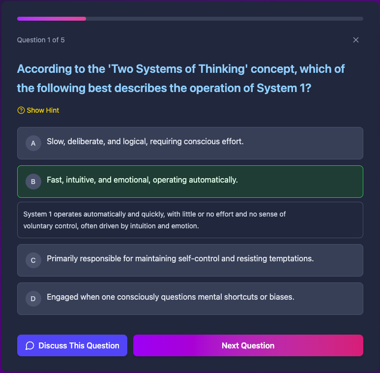

# Gemini Study

[](https://github.com/mmtftr/gemini-study/stargazers)
[](https://opensource.org/licenses/MIT)

Study with Gemini 2.5's help, with complete privacy. An AI-powered quiz generation and learning platform that helps you master any topic through interactive quizzes and intelligent tutoring.

Try it out at [https://quiz.mmtf.dev](https://quiz.mmtf.dev)!

## 📸 Screenshots

### Welcome & Introduction

*Get started with the intuitive welcome screen and feature overview*

### Interactive Quiz Experience

*Take engaging quizzes with hints, explanations, and real-time feedback*

### AI-Powered Discussion

*Discuss any question with AI tutoring for deeper understanding*

### Detailed Results & Analytics

*Get comprehensive performance analysis and personalized feedback*

### Keyboard Shortcuts

*Efficient navigation with built-in keyboard shortcuts*

## 🚀 Features

### 📚 Course Management
- **Create Custom Courses**: Organize your learning materials into structured courses
- **AI Course Generation**: Automatically generate comprehensive courses with web-sourced content
- **Content Library**: Add text content, documents, and notes to build your knowledge base
- **Smart Organization**: Edit, update, and manage your learning materials with ease

### 🧠 AI-Powered Quizzes
- **Dynamic Quiz Generation**: Create quizzes from your course content or any topic
- **Multiple AI Models**: Choose from Gemini 2.5 Flash, Pro, or 2.0 Flash for different quality/speed preferences
- **Real-time Streaming**: Questions are generated and streamed live for immediate engagement
- **Adaptive Difficulty**: Questions tailored to your content and learning level

### 💬 Interactive Learning
- **AI Tutoring**: Discuss any question with intelligent AI assistance
- **Concept Exploration**: Deep dive into topics through natural conversation
- **Hint System**: Get guided hints without revealing answers
- **Contextual Help**: AI understands your answer choices and provides targeted guidance

### 📊 Performance Analytics
- **Detailed Progress Tracking**: Monitor your learning journey across all courses
- **AI Performance Analysis**: Get personalized feedback and improvement suggestions
- **Quiz History**: Review past attempts and track improvement over time
- **Smart Recommendations**: Receive targeted study suggestions based on your performance

### 🔒 Privacy-First Design
- **100% Local Storage**: All your data stays in your browser (and Google's servers)
- **No Server Required**: Direct communication with Google's Gemini API only
- **Secure API Key Management**: Your API key is stored on-device
- **Offline Course Management**: Manage courses and content without internet

## 🛠 Technology Stack

- **Frontend**: React 18 + TypeScript
- **Styling**: Tailwind CSS with custom animations
- **AI Integration**: Google Gemini API (@google/genai)
- **Storage**: IndexedDB for local data persistence
- **Build Tool**: Vite
- **Deployment**: Cloudflare Pages via Wrangler

## 📋 Prerequisites

- Node.js (v16 or higher)
- A Google Gemini API key ([Get one here](https://aistudio.google.com/app/apikey))
- Cloudflare account (for deployment)

## 🚀 Quick Start

### Local Development

1. **Clone the repository**
   ```bash
   git clone https://github.com/mmtftr/gemini-study.git
   cd gemini-study
   ```

2. **Install dependencies**
   ```bash
   npm install
   ```

3. **Start the development server**
   ```bash
   npm run dev
   ```

4. **Open your browser**
   Navigate to `http://localhost:5173` and enter your Gemini API key to get started!

### Production Deployment

Deploy to Cloudflare Pages with a single command:

```bash
npm run deploy
```

**Requirements for deployment:**
- Cloudflare account
- Wrangler CLI configured (`npx wrangler login`)

The deploy command automatically builds the project and deploys to Cloudflare Pages.

## 🎯 How to Use

### Getting Started
1. **API Key Setup**: Enter your Google Gemini API key on first launch
2. **Choose Your Model**: Select from Gemini 2.5 Flash, Pro, or 2.0 Flash
3. **Create Your First Course**: Either generate one with AI or create manually

### Creating Content
- **Manual Courses**: Add your own text content, study materials, and notes
- **AI-Generated Courses**: Provide a topic and let AI create comprehensive course materials
- **Content Management**: Edit, update, and organize your materials as needed

### Taking Quizzes
- **Course-Based Quizzes**: Generate quizzes from your course content
- **Topic-Based Quizzes**: Create quizzes on any subject without course materials
- **Interactive Experience**: Get hints, discuss questions, and receive immediate feedback

### Learning Features
- **Question Discussion**: Click "Discuss" to chat with AI about any question
- **Performance Analysis**: Review detailed AI-generated feedback after each quiz
- **Progress Tracking**: Monitor improvement across multiple quiz attempts

## 🎮 Keyboard Shortcuts


- **1-4**: Select answer options during questions
- **H**: Toggle hint display
- **D**: Start AI discussion
- **→**: Next question (after answering)
- **Esc**: Close modals and dialogs

## 🔧 Configuration

### Environment Variables

Create a `.env.local` file for local development:

```env
GEMINI_API_KEY=your_api_key_here
```

*Note: In production, API keys are entered through the UI and stored locally.*

### Available Scripts

- `npm run dev` - Start development server
- `npm run build` - Build for production
- `npm run preview` - Preview production build
- `npm run deploy` - Deploy to Cloudflare Pages
- `npm run typecheck` - Run TypeScript type checking

## 🌟 Key Benefits

- **Complete Privacy**: Your data stays on your device
- **Unlimited Learning**: Create quizzes on any topic imaginable
- **Adaptive AI**: Three different Gemini models for various needs
- **Rich Interactions**: Not just quizzes - engage in meaningful learning conversations
- **Progress Tracking**: Detailed analytics to guide your learning journey
- **Zero Setup**: No backend required - just add your API key and start learning

## 🤝 Contributing

We welcome contributions! Please feel free to submit issues, feature requests, or pull requests.

## 🔗 Links

- **GitHub Repository**: [mmtftr/gemini-study](https://github.com/mmtftr/gemini-study)
- **Get Gemini API Key**: [Google AI Studio](https://aistudio.google.com/app/apikey)
- **Cloudflare Pages**: [Deploy Documentation](https://developers.cloudflare.com/pages/)

---

**Start your AI-powered learning journey today!** 🎓✨

Built with AI Studio Builder and Claude Sonnet 4.
